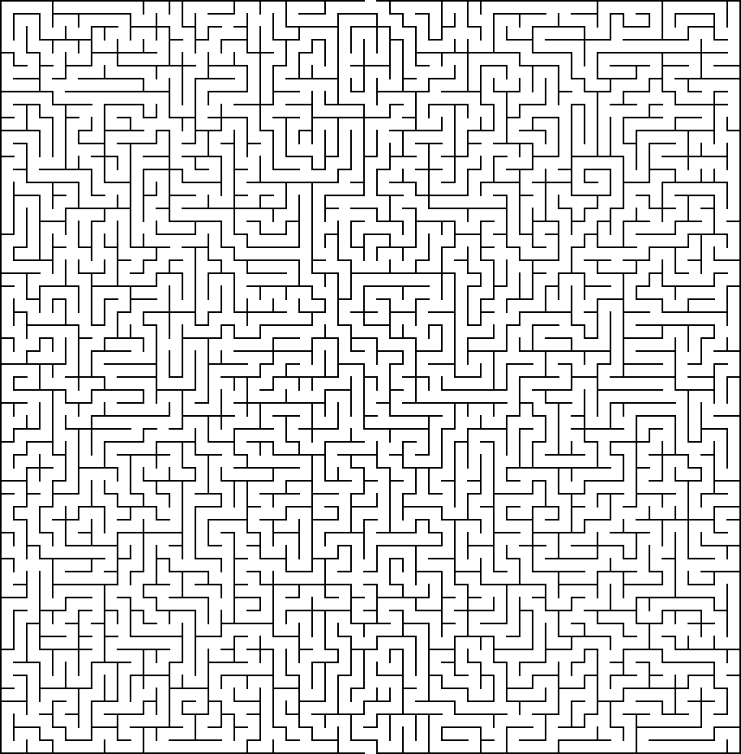
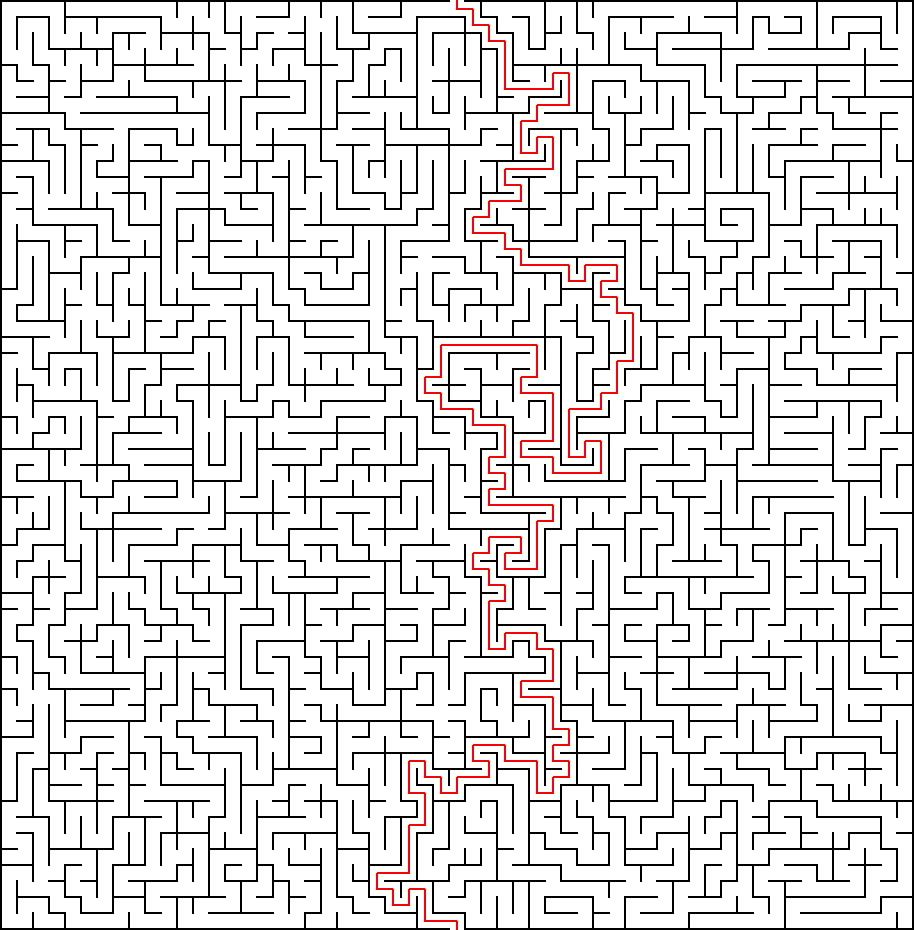
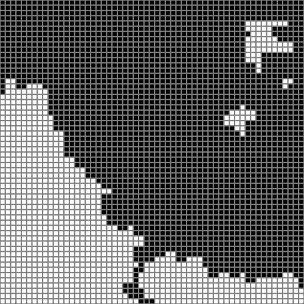
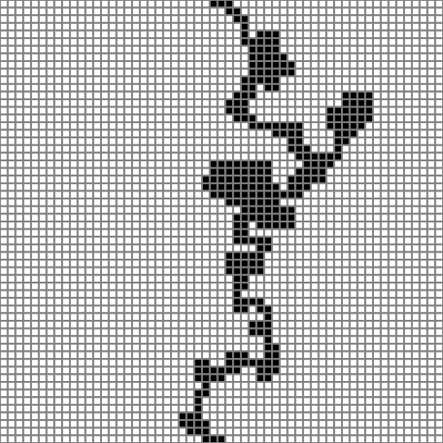
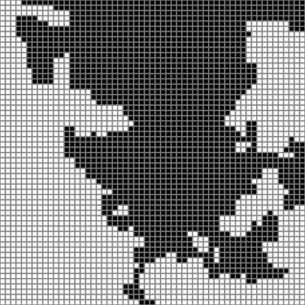
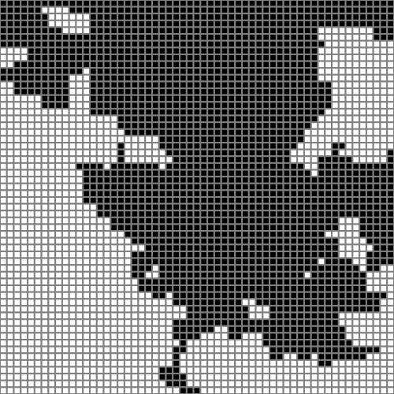

# maze-solver

This project compares multiple uninformed and informed search algorithms by solving a randomly generated maze.

## Input maze

## Solution 

---
## Methods Used to Solve the Maze (In order of efficiency)
- DFS
- A* with Manhattan Distance
- A* with Eulidean Distance
- BFS

### BFS

\# of Expanded Verticies = 2290

### DFS

\# of Expanded Verticies = 298

### A* with Manhattan Distance

\# of Expanded Verticies = 1687

### A* with Eulidean Distance

\# of Expanded Verticies = 1879
